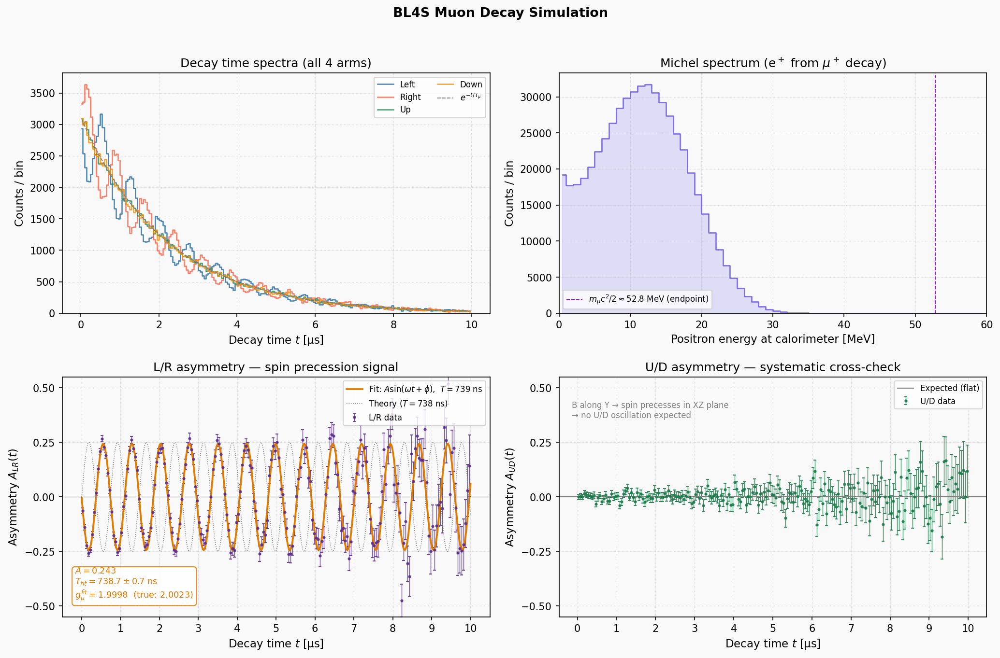

A simulation of a 120GeV proton beam interacting with a target, using Geant4. The simulation includes the generation of secondary particles and their interactions with the surrounding materials. The output data can be analyzed to study particle production, energy deposition, and other relevant physical phenomena.

